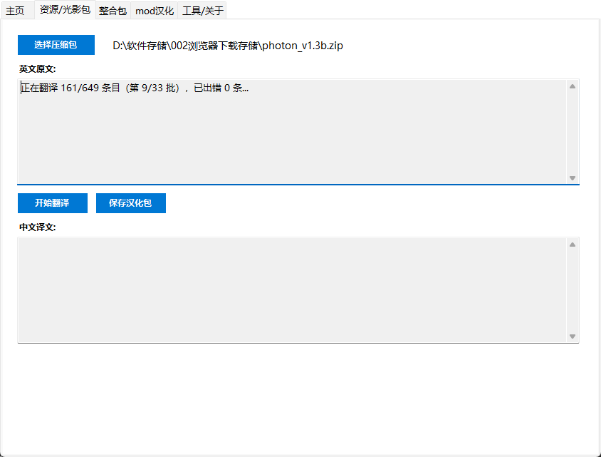
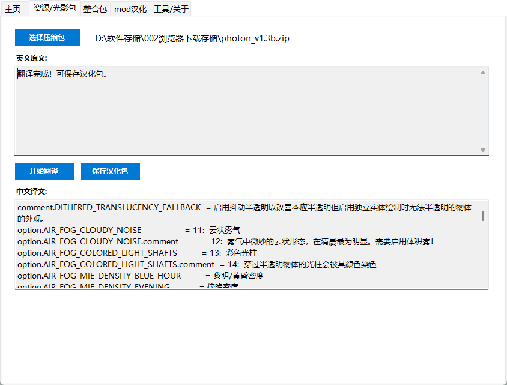

# 🧊 Minecraft 资源包/光影/整合包汉化器

> **拖拽一下，英文材质包秒变中文！**  
> 支持百度翻译（免费额度）和 DeepSeek（AI 精准术语）双引擎，专为 MC 玩家打造。

---

## ✨ 核心功能

- 🖱️ **拖拽即译**：直接拖入 `.zip` 压缩包，自动识别并提取英文文本
- 🤖 **双引擎翻译**  
  - **百度翻译**：每月免费 100 万字符，零成本  
  - **DeepSeek**：大模型翻译，已内置红石、下界、附魔等 MC 专用术语
- 💾 **一键导出**：保存为中文资源包/光影包/整合包汉化资源包，直接放入游戏加载
- 📦 **整合包支持**：选择整合包 `mods` 文件夹，自动扫描所有模组语言文件，生成一站式汉化
- 🌐 **CFPA 社区汉化集成**：可自动下载 CFPA 社区维护的汉化资源包，覆盖数千个模组，优先使用已有翻译，仅对缺失条目进行 AI 翻译
- 🔄 **断点续翻**：中途出错或手动暂停后，可继续上次进度，不重复翻译
- ⏸️ **暂停/恢复**：随时暂停翻译任务，稍后无缝继续
- 🔐 **密钥加密存储**：API 密钥使用 Windows 系统级加密保存在本地，安全可靠
- 🎨 **蓝白分页界面**：主页 / 资源光影 / 整合包 / 工具关于，功能清晰不重叠

---

## 📥 快速下载

- **GitHub Releases**：[点击下载最新版本](https://github.com/qiling123/MCTranslator/releases)  
- **夸克网盘**：链接：https://pan.quark.cn/s/d47a88d3106b?pwd=DXZU 提取码：DXZU  
- **B站专栏**：[详细使用教程与演示] 【【MC玩家必备】光影/材质包一键汉化工具，再也不怕英文选项了！-哔哩哔哩】 https://b23.tv/96rqB5v)

---

## 📸 软件截图（可选）

---

## 🚀 使用教程

### 1️⃣ 获取翻译引擎密钥

#### ✅ 百度翻译（免费）
1. 打开 [百度翻译开放平台](https://fanyi-api.baidu.com) 注册并登录  
2. 开通「通用翻译」服务（每月免费 100 万字符）  
3. 在控制台获取 **APP ID** 和 **密钥**

#### ✅ DeepSeek（推荐，翻译更准）
1. 打开 [DeepSeek 开放平台](https://platform.deepseek.com) 注册并登录  
2. 进入左侧「API Keys」创建新密钥  
3. 充值任意金额（最低 1 元，翻译成本极低）  
4. 模型保持 `deepseek-chat` 即可

### 2️⃣ 汉化资源包 / 光影包
1. 打开软件，在「主页」标签选择翻译引擎并填入密钥  
2. 切换到「资源/光影包」标签  
3. 点击「选择压缩包」或直接拖拽 `.zip` 文件到窗口  
4. 点击「开始翻译」，等待进度完成  
5. 点击「保存汉化包」，将生成的 `.zip` 放入：
   - 资源包 → `.minecraft/resourcepacks`
   - 光影包 → `.minecraft/shaderpacks`
6. 在游戏中启用该资源包

### 3️⃣ 汉化整合包
1. 切换到「整合包」标签  
2. 勾选「优先使用 CFPA 社区汉化」（推荐，大幅减少翻译量）  
3. 点击「选择整合包文件夹」，选择你的 `mods` 目录  
4. 工具自动扫描所有模组语言文件，并（如果勾选）下载最新 CFPA 汉化资源包进行差分  
5. 点击「开始翻译」，仅对缺失条目调用 AI  
6. 点击「保存汉化包」，生成整合包汉化资源包  
7. 将保存的 zip 放入 `resourcepacks`，配合 [Resource Loader](https://www.curseforge.com/minecraft/mc-mods/resource-loader) 或 [i18n自动汉化更新](https://www.curseforge.com/minecraft/mc-mods/i18nupdatemod) 模组使用

---

## 🛠️ 常见问题

**Q：翻译质量怎么样？**  
A：DeepSeek 模式已内置 MC 专用术语（方块、下界、红石、附魔…），翻译结果贴近玩家习惯，不是生硬的机翻。

**Q：安全吗？**  
A：本工具仅在本地运行，API 密钥使用 Windows 系统自带的 DPAPI 加密存储，不会上传到任何第三方服务器。

**Q：支持哪些光影/材质包？**  
A：理论上支持所有符合标准结构的光影包（OptiFine）和资源包（Java 版 1.13+ 的 JSON 格式和旧版 .lang 格式都支持）。

**Q：整合包汉化后如何生效？**  
A：请安装 [i18n自动汉化更新模组](https://www.curseforge.com/minecraft/mc-mods/i18nupdatemod) 或 [Resource Loader](https://www.curseforge.com/minecraft/mc-mods/resource-loader)，并将生成的汉化资源包放入 `resourcepacks` 并启用。

---

## ⚖️ 版权声明

本软件由 **B站UP主「南_岳」** 原创开发。  
**未经作者允许，禁止将本软件用于任何商业用途，违者将承担法律责任。**  

本工具集成的 **CFPA 社区汉化资源包** 遵循 [CC BY-NC-SA 4.0](https://creativecommons.org/licenses/by-nc-sa/4.0/) 协议。  
感谢 [CFPAOrg](https://github.com/CFPAOrg) 团队及所有贡献者的辛勤付出。

---

## 🤝 贡献与反馈

欢迎在 Issues 中提出 Bug 或建议，也欢迎前往 B 站关注「南_岳」获取最新动态。  
**原创不易，感谢你的支持！**